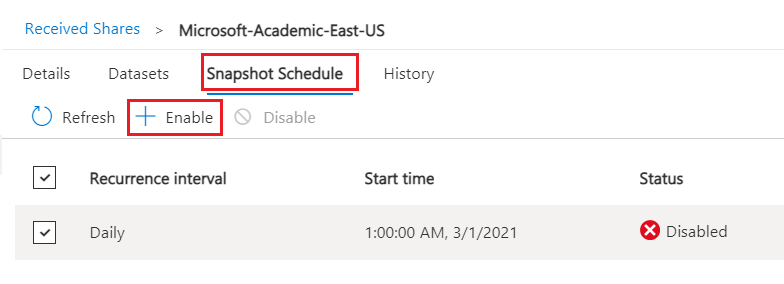
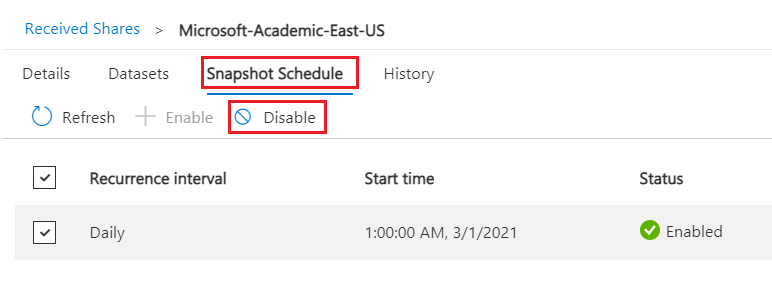

[!INCLUDE [ma-retirement](../includes/ma-retirement.md)]

# Frequently Asked Questions about Microsoft Academic Graph

Answers some of the most frequently asked questions about the Microsoft Academic Graph

## License

Microsoft Academic Graph is licensed under [ODC-BY](https://opendatacommons.org/licenses/by/1.0/)

When using Microsoft Academic data (MAG, MAKES, etc.) in a product or service, or including data in a redistribution, please acknowledge Microsoft Academic using the URI https://aka.ms/msracad. For publications and reports, please cite following articles:

> [!NOTE]
>
> - Arnab Sinha, Zhihong Shen, Yang Song, Hao Ma, Darrin Eide, Bo-June (Paul) Hsu, and Kuansan Wang. 2015. An Overview of Microsoft Academic Service (MA) and Applications. In Proceedings of the 24th International Conference on World Wide Web (WWW '15 Companion). ACM, New York, NY, USA, 243-246. DOI=http://dx.doi.org/10.1145/2740908.2742839
>
> - K. Wang et al., “A Review of Microsoft Academic Services for Science of Science Studies”, Frontiers in Big Data, 2019, doi: 10.3389/fdata.2019.00045

## How much does Microsoft Academic Graph cost

Microsoft Academic Graph is currently in free preview. Consumers incur costs only on their own Azure resource usage associated with graph (i.e. storing, downloading, processing, analytics, etc.). See the [pricing](resources-pricing.md) page for Azure cost estimator links that pre-populate storage costs associated with storing the approximate size of the graph.

It's important to note that old versions of MAG are not removed or modified in any way by the provisioning process, so if you have signed up for automatic provisioning you are responsible for removing older releases.

We are updating the data and send out a new copy every 2 weeks. However, the customer can decide to delete the old copies once they receive the new one.

## How frequently is Microsoft Academic Graph updated

New Microsoft Academic Graph releases occur approximately every 1-2 weeks.

## How is the field of study hierarchy generated

The topical hierarchy is generated by applying a NLP technique called hierarchical topic modeling, namely, we have asked our machine to infer based on all the documents it has read and understood. This is regenerated  with every new graph release and published to the [hierarchical browser on Microsoft Academic](https://academic.microsoft.com/#/topics/0/). Technical details of the computation method have been published in the Association for Computational Linguistics (ACL), please see [A web-scale system for scientific knowledge exploration](https://academic.microsoft.com/#/detail/2803115315).

## What format are paper abstracts published in

Due to legal constraints, paper abstracts in Microsoft Academic Graph cannot be published as plaintext. They are instead available as an [inverted index](https://en.wikipedia.org/wiki/Inverted_index) in the PaperAbstractInvertedIndex stream. Inverted indexes store information about each word in a body of text, including the number of occurrences and the position of each occurrence.

## How does Microsoft Academic Graph leverage author supplied keywords for papers

Microsoft Academic Graph doesn't publish the raw author supplied keywords that are often published on academic publications. Instead, we leverage author supplied keywords along with other information to associate fields of study with papers. This information is available in the PaperFieldsOfStudy stream.

## What is the Rank value on entities

"Rank" values are a static rank associated with each entity in the Microsoft Academic Graph. The static rank  roughly reflects the log probability of an entity being "important" represented as an integer by multiplying it by -1000, i.e.:

> [!NOTE]
> Rank = -1000 * Ln( probability of an entity being important )

An entities "importance" is calculated using its relationships with other entities in the graph, e.g. a paper entity recently published in Nature receiving a high number of citations is likely to have high importance, whereas a pre-print paper entity not associated with a conference/journal is likely to have a low importance.

## What is the cost to compute authors citation counts and h-index

It is relatively easy and inexpensive to compute citation counts and h-index using [U-SQL](https://msdn.microsoft.com/azure/data-lake-analytics/u-sql/u-sql-language-reference) with [Azure Data Lake Analytic](https://azure.microsoft.com/services/data-lake-analytics/) for all authors in MAG, currently 250 million in total. The cost range from $1 (USD) with 1 AU running for 40 minutes to $2 with 16AU running for 5 minutes.

## What is FamilyId in Papers

A paper "family" is defined as a group of papers that have been determined to be the same fundamental paper, but published in different venues (e.g. pre-print and conference). In this case only one of the papers will be determined to be the "primary" paper, and each paper in the family group will have its "FamilyId" value set to the primary papers ID.

If the "FamilyId" value is not defined for a paper it means that the paper is not part of a larger family group, however it is still considered to be the primary paper of a single-paper family."

## Rank vs. FamilyRank in Papers

Rank of a paper is the static rank associated with the individual paper.

For papers belonging to paper families, all papers of the same family have the same FamilyRank value, which represents the aggregated rank of all papers in the family.

For papers not having a FamilyId, the FamilyRank is null.

## PaperCount vs. PaperFamilyCount

PaperCount is the number of papers associated with the entity.

PaperFamilyCount is the number of primary family papers associated with the entity.

## Why are we distributing the Microsoft Academic Graph using Azure Data Share?

We now utilize Azure Data Share to distribution datasets. Here are some benefits for using Azure Data Share.

- Better security: no need to share the Azure Storage account key with Microsoft Academic.
- Users now have full control of their data snapshot requests. Users may select a one-time snapshot of latest dataset or recurring releases when new datasets are available.  Users are also able to cancel recurring releases when no longer needed. 

## How to get the latest dataset

  You can get the latest MAG dataset using your Data Share service.

  Azure Portal Home -> Your Data Share service -> Received Shares -> "Microsoft-Academic-\<Location\>" -> Trigger snapshot -> Full Copy

   

## How to start recurring provisioning of datasets

  To enable a snapshot schedule, you select the **Snapshot Schedule** tab. Check the box next to the snapshot schedule and select **Enable**.

  

## How to stop recurring provisioning of datasets

  To disable a snapshot schedule, you select the **Snapshot Schedule** tab. Check the box next to the snapshot schedule and select **Disable**.

  
