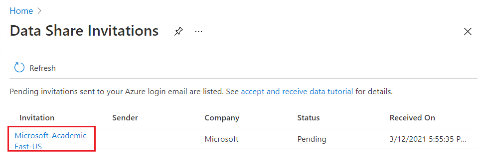
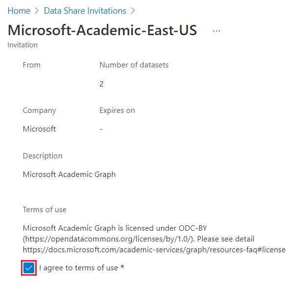
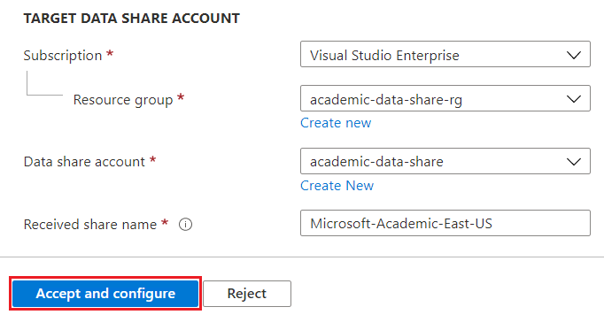
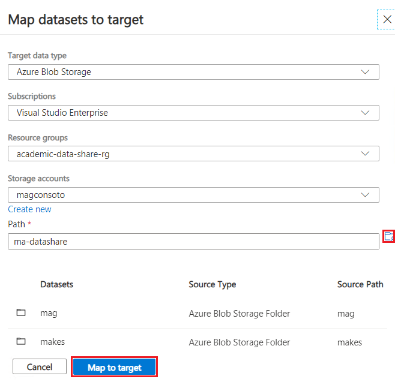
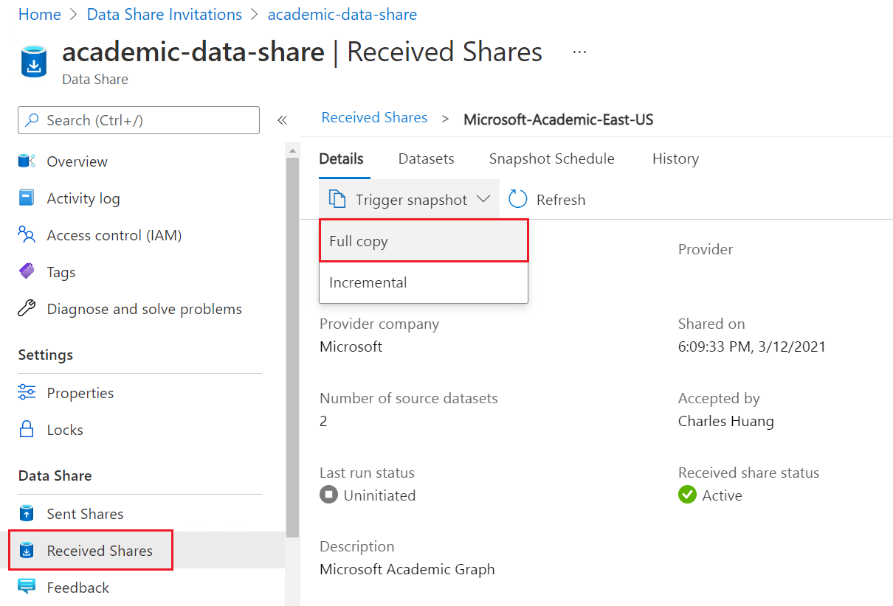

Details step-by-step instructions for receiving Microsoft Academic data using Azure Data Share.

## Prerequisites

Before you can accept Azure Data Share invitation to receive Microsoft Academic data, you must provision a number of Azure resources below. Ensure that all pre-requisites are complete before accepting a data share invitation.

* Set up provisioning of Microsoft Academic Graph to an Azure blob storage account. See [Get Microsoft Academic Graph on Azure storage](./get-started-setup-provisioning.md).
* A Data Share invitation: An invitation from Microsoft Azure with a subject titled "Azure Data Share invitation from **<yourdataprovider@domain.com>**.
* Register the [Microsoft.DataShare resource provider](https://docs.microsoft.com/azure/data-share/concepts-roles-permissions#resource-provider-registration) in the Azure subscription where you will create a Data Share resource and the Azure subscription where your target Azure data stores are located.
* Permission to write and add role assignment to the storage account. These permissions exist in the Owner role.

## Gather the information that you need

Before you begin, you should have these items of information:

   :heavy_check_mark:  The name of your Azure Storage (AS) account from [Get Microsoft Academic Graph on Azure storage](./get-started-setup-provisioning#note-azure-storage-account-name).

   :heavy_check_mark:  The name of the container in your Azure Storage account from [Get Microsoft Academic Graph on Azure storage](./get-started-setup-provisioning#create-a-blob-container).

## Sign in to the Azure portal

Sign in to the [Azure portal](https://portal.azure.com/).

## Open your invitation

1. You can open the invitation from your email client or directly from the Azure portal. 

   * To open invitation from email, check your inbox for an invitation from your data provider. The invitation is from Microsoft Azure, titled **Azure Data Share invitation from <yourdataprovider@domain.com>**. Click on **View invitation** to see your invitation in Azure. 

   * To open invitation from Azure portal directly, search for **Data Share Invitations** in Azure portal. This action takes you to the list of Data Share invitations.

1. Select the share you would like to view. 

    

## Accept the invitation

1. Make sure all fields are reviewed, including the **Terms of Use**. If you agree to the terms of use, you'll be required to check the box to indicate you agree. 

    

1. Under *Target Data Share Account*, select the Subscription and Resource Group that you'll be deploying your Data Share into. 

   For the **Data Share Account** field, select **Create new** if you don't have an existing Data Share account. Otherwise, select an existing Data Share account that you'd like to accept your data share into. 

   For the **Received Share Name** field, you may leave the default specified by the data provide, or specify a new name for the received share. 

   Once you've agreed to the terms of use and specified a Data Share account to manage your received share, Select **Accept and configure**. A share subscription will be created. 

   This action takes you to the received share in your Data Share account. 

   If you don't want to accept the invitation, Select **Reject**. 

    

## Configure received share

Follow the steps below to configure where you want to receive data.

1. Select the **Datasets** tab. Check the box next to the dataset you'd like to assign a destination to. Select **+ Map to target** to choose a target data store. Check both `mag` and `makes` to receive MAG and MAKES data. Or check one dataset to receive only MAG data or only MAKES data.

    

1. Provide values to specify the target data location that you'd like the data to land in. Any data files or tables in the target data store with the same path and name will be overwritten. Select **Map to target**.

    |Property  |Description  |
    |---------|---------|
    |**Target data type** | Azure Blob Storage |
    |**Subscription** | From the drop-down, select your Azure subscription. |
    |**Resource group** | Specify whether you want to create a new resource group or use an existing one. A resource group is a container that holds related resources within an Azure subscription. For more information, see [Azure Resource Group overview](https://docs.microsoft.com/azure/azure-resource-manager/resource-group-overview). You can use the same resource group as the Data Share service.|
    |**Storage account name** | Select the Azure storage account created in [Get Microsoft Academic Graph on Azure storage](./get-started-setup-provisioning#create-an-azure-storage-account), e.g. `mag<org_name>`. |
    |**Path**    | Select the blob storage container created in . e.g. `ma-datashare`. |

     

    

## Trigger a snapshot

1. Trigger a snapshot by selecting **Details** tab followed by **Trigger snapshot**. Here, you can trigger a full or  incremental snapshot of your data. If it is your first time receiving data from your data provider, select **Full copy**. 

    

1. When the last run status is *successful*, go to the target data store to view the received data. Select **Datasets**, and click on the link in the Target Path. 

    

1. You will find MAG data in `<StorageAccount>/<ContainerName>/mag/yyyy-mm-dd` and MAKES data in `<StorageAccount>/<container>/makes/yyyy-mm-dd/`. 

## Enable snapshot schedule (Optional)

1. If you do not want to automatically receive updated versions of MAG or MAKES when they are available, you may skip this step.

1. To receive regular updates to the data, enable a snapshot schedule by selecting the **Snapshot Schedule** tab. Check the box next to the snapshot schedule and select **+ Enable**.

   
