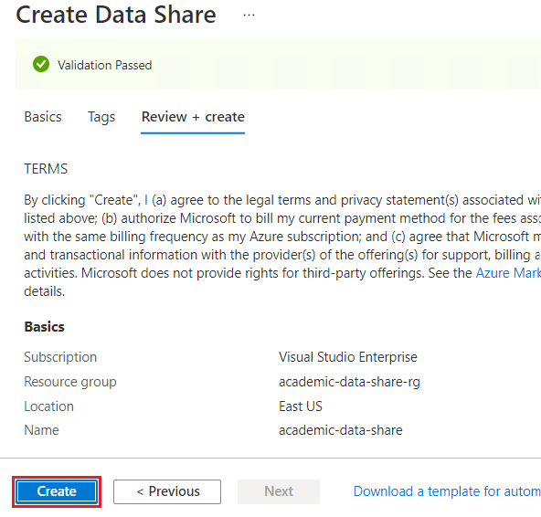
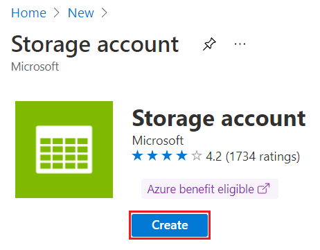
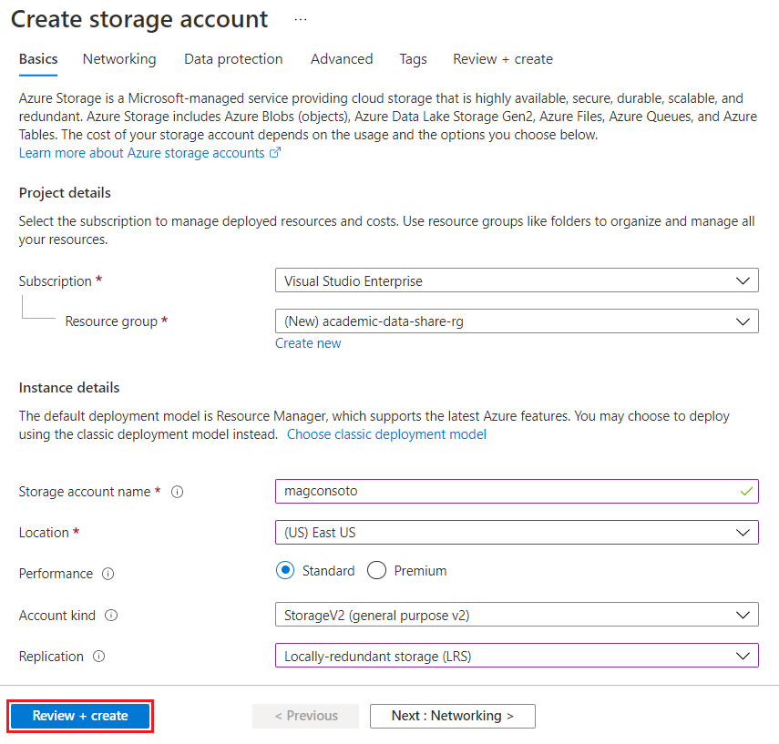
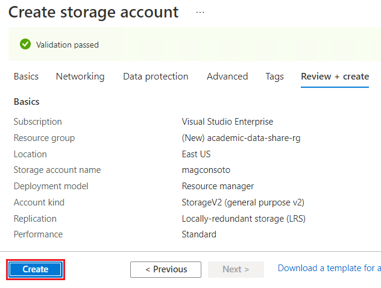
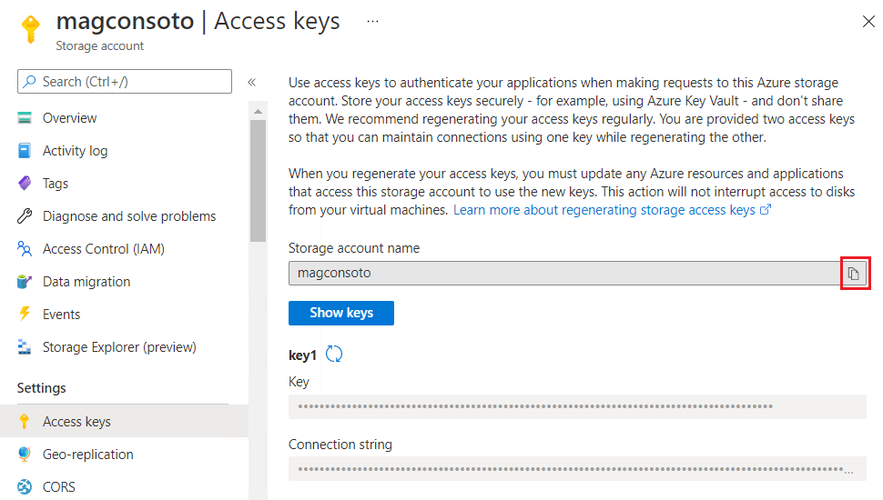

Details step-by-step instructions for setting up one-time or automatic provisioning of Microsoft Academic Data (MAKES/MAG) to an Azure blob storage account.

## Open Data License: [ODC-BY](https://opendatacommons.org/licenses/by/1.0/)

When using Microsoft Academic Data (MAG, MAKES, etc.) in a product or service, or including data in a redistribution, please acknowledge Microsoft Academic using the URI https://aka.ms/msracad. For publications and reports, please cite following articles:

> [!NOTE]
>
> - Arnab Sinha, Zhihong Shen, Yang Song, Hao Ma, Darrin Eide, Bo-June (Paul) Hsu, and Kuansan Wang. 2015. An Overview of Microsoft Academic Service (MA) and Applications. In Proceedings of the 24th International Conference on World Wide Web (WWW '15 Companion). ACM, New York, NY, USA, 243-246. DOI=http://dx.doi.org/10.1145/2740908.2742839
>
> - K. Wang et al., "A Review of Microsoft Academic Services for Science of Science Studies", Frontiers in Big Data, 2019, doi: 10.3389/fdata.2019.00045

> [!NOTE]
> MAG is currently in a free preview period, so there are no charges associated with the provisioning or use of the data/service itself. However Azure requires you to cover all costs associated with standard resource creation, usage, etc. For cost estimates associated with MAG please see the [Pricing](resources-pricing.md) page.   Most research institutions have an "Enterprise Account" with Microsoft including Azure subscription. The pricing for Enterprise Accounts differ from the individual account shown in Azure's price calculator.   If you have an Enterprise Account, please check with your individual institution's Information Technology/Computer Center resource on the process of setting up Azure to get MAG. You might need to obtain a "Master Agreement #" and involve MLSP (Microsoft Licensed Solution Provider) for help.

## Setup data share and storage account to receive Microsoft Academic Data releases

### Create an Azure Subscription

Please [create a new Azure subscription](https://azure.microsoft.com/get-started) for the distribution previews. If your organization already using Azure, this could be a separate subscription under the same tenant id. If you start from scratch, for example "create Azure free account", the subscription will be created under a new tenant id.

### Sign in to the Azure portal

Sign in to the [Azure portal](https://portal.azure.com/).

### [Create an Azure Data Share Service](https://azure.microsoft.com/services/data-share/)

1. Home > Create a resource > Data Share > Create.

    

1. Provide following values to create a Data Share service. Then select **Review + create**. 

    |Property  |Description  |
    |---------|---------|
    |**Subscription** | From the drop-down, select your Azure subscription. |
    |**Resource group** | Specify whether you want to create a new resource group or use an existing one. A resource group is a container that holds related resources within an Azure subscription. For more information, see [Azure Resource Group overview](https://docs.microsoft.com/azure/azure-resource-manager/resource-group-overview). |
    |**Location**    | Select one of the locations below which is most appropriate for you.   - `East Asia`   - `UK South`   - `US East`   - `US West`   - `West Europe` |
    |**Name** | Provide a name for your Data Share service. |

     

    

1. Verify that the information you entered is correct and select **Create**.

    

### [Create an Azure Storage Account](https://docs.microsoft.com/azure/storage/common/storage-quickstart-create-account)

1. Home > Create a resource > Storage > Storage account > Create

    

1. Provide following values to create an Azure Storage account. Then select **Review + create**.

    |Property  |Description  |
    |---------|---------|
    |**Subscription** | From the drop-down, select your Azure subscription. |
    |**Resource group** | Specify whether you want to create a new resource group or use an existing one. A resource group is a container that holds related resources for an Azure solution. For more information, see [Azure Resource Group overview](https://docs.microsoft.com/azure/azure-resource-manager/resource-group-overview). You can use the same resource group as the Data Share service.|
    |**Storage account name** | Provide a name for your storage account (**mag<org_name>**), e.g. `magconsoto`. You don't need to use your organization name after the "mag", however the account name must be unique among all Azure Storage accounts. |
    |**Location**    | Select the same location as the Data Share service. |
    |**Performance** | Standard |
    |**Account kind**| StorageV2 (general purpose v2) |
    |**Replication** | Select the desired replication mode |

     

    

1. Verify that the information you entered is correct and select **Create**.

    

### Note Azure storage account name

1. Once notified that the storage account has been created, click "Go to resource"

    

1. Go to "access keys" and take note of the "storage account name"

    

## Create a Blob Container

1. Follow [the instructions here](https://docs.microsoft.com/azure/storage/blobs/storage-quickstart-blobs-portal#create-a-container) to create a blob container.

1. Name the blob container (i.e. `ma-datashare`).

## Make sure that you have these items of information

   :heavy_check_mark:  The email address you used to log on to Azure portal.

   :heavy_check_mark:  The location of your Azure Storage (AS) account (i.e. `East US`).

   :heavy_check_mark:  The name of your Azure Storage (AS) account (i.e. `magconsoto`).

   :heavy_check_mark:  The name of your Azure Storage blob container (i.e. `ma-datashare`). This infomation is needed in [Accept and receive data using Azure Data Share](get-started-receive-data.md).

## Sign up for Microsoft Academic Data provisioning

To sign up for Microsoft Academic Data on AS distribution preview, send the following information **using your school or company email account** to <a href="mailto:academicapi@microsoft.com?subject=Access request to Microsoft Academic Data on Azure Storage (AS) distribution preview">academicapi@microsoft.com</a> with the subject "Access request to Microsoft Academic Data on Azure Storage (AS) distribution preview":

- Are you affiliated with a company or university?
  - If company, please provide the company's name, your department/group and your role
  - If university, please provide the university's name, department, group/advisor, and your role (undergraduate student, grad student, professor, etc.)
- Brief description of the project you will be using Microsoft Academic Data for
- Name of your Microsoft sales representative, if you have one
- The email address you used to log on to Azure portal
- The location of your Azure Storage (AS) account
- The name of your Azure Storage (AS) account
