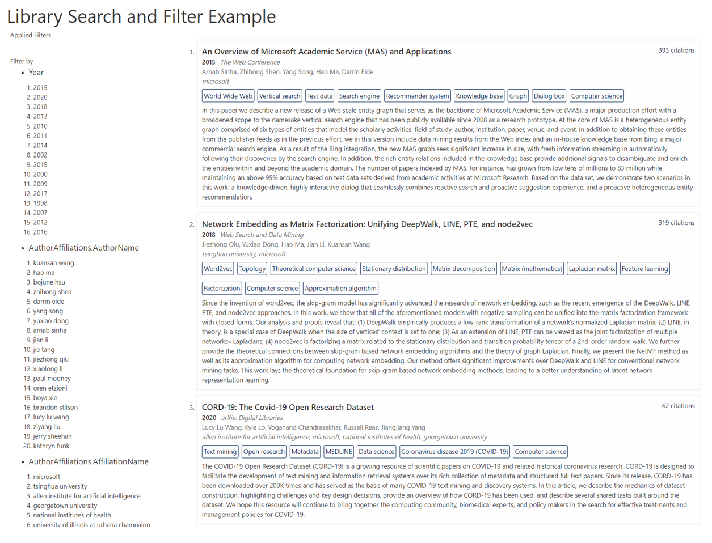
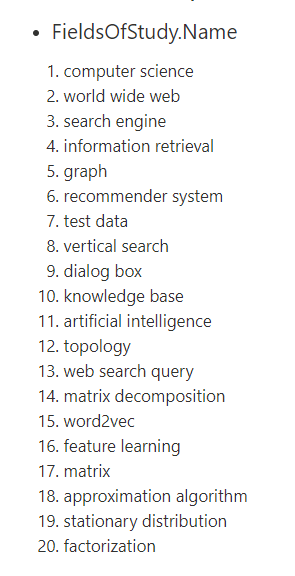

---
title: Schema Design
description: Step by step tutorial to design MAKES schema for custom data
ms.topic: tutorial
ms.date: 10/15/2020
---

# Design schema for filter and search

This tutorial illustrates how to

- Design a MAKES schema for private publications to enable search and smart filters.
- Build a filterable paper list UI (as shown below) using MAKES APIs.



This tutorial is a continuation of the [Link private publication records with MAKES entities](tutorial-entity-linking.md) tutorial.

## Prerequisites

- [Microsoft Academic Knowledge Exploration Service (MAKES) subscription](get-started-setup-provisioning.md) (release after 11/10)
- Completion of [Link private publication records with MAKES entities](tutorial-entity-linking.md) tutorial
- Read through [How to define index schema](how-to-index-schema.md)
- Download [Schema for linked sample library publication](samplePrivateLibraryData.linked.schema.json)

## Design a schema for linked private library publication

For any MAKES schema design, we need to determine

- What entity attributes to include ?
- What are the appropriate data types are for each entity attribute ?
- What index operations should the entity attributes support ?

In this tutorial, we will build a library application with search and filter capabilities. We will start by designing a schema and building a custom index to power the app. We will be leveraging the linked private library publications from previous tutorial as the input entities for building the custom index. You should have a file named **samplePrivateLibraryData.linked.json** in your working directory from completing [Link private publication records with MAKES entities](tutorial-entity-linking.md) tutorial.

Here's an entity as example from **samplePrivateLibraryData.linked.json**

```json
{
    "OriginalTitle": "Microsoft Academic Graph: When experts are not enough",
    "FullTextUrl": "http://localhost/example-full-text-link-1",
    "Id": 3002924435,
    "logprob": -19.625,
    "DOI": "10.1162/QSS_A_00021",
    "Year": 2020,
    "VenueFullName": "Quantitative Science Studies",
    "CitationCount": 16,
    "EstimatedCitationCount": 16,
    "FieldsOfStudy": [
        {
            "OriginalName": "World Wide Web",
            "Name": "world wide web"
        },
        {
            "OriginalName": "Knowledge graph",
            "Name": "knowledge graph"
        },
        ...
    ],
    "AuthorAffiliations": [
        {
            "Sequence": 1,
            "OriginalAuthorName": "Kuansan Wang",
            "AuthorName": "kuansan wang",
            "OriginalAffiliationName": "Microsoft Research, Redmond, WA, 98052, USA",
            "AffiliationName": "microsoft"
        },
       ...
    ],
    "OriginalAbstract": "An ongoing project explores the extent to which artificial intelligence (AI), specifically in the areas of natural language processing and semantic reasoning, can be exploited to facilitate the stu...",
    "Title": "microsoft academic graph when experts are not enough",
    "TitleWords": [ "microsoft", "academic", "graph", "when", "experts", "are", "not", "enough"],
    "AbstractWords": [ "an", "ongoing", "project", "explores", "the", "extent", "to", "which", "artificial", "intelligence", "ai", "specifically", "in", "areas", "of", "natural", "language", "processing", "and", "semantic", "reasoning", "can", "be", "exploited","facilitate", "stu"]
}
```

We are designing a schema that will

1. Show publication information in Publication List Items
    

2. Create filter suggestions in Filter Sections
    

3. Filter the publications
    

We've include a complete schema for you to compare against. See [Schema for Linked Sample Library Data](samplePrivateLibraryData.linked.schema.json). The schema corresponds to the following table:

| Attribute Name | Description| Index Data Type | Index Operations |
| ---- | ---- | ---- | ---- |
| OriginalTitle | Used in Publication List Item as display only attribute. | Blob? | - |
| OriginalAbstract | Used in Publication List Item as display only attribute. | Blob? | - |
| FullTextUrl | Used in Publication List Item as display only attribute. | Blob? | - |
| VenueFullName | Used in Publication List Item as display only attribute. | Blob? | - |
| EstimatedCitationCount | Used in Publication List Item as display only attribute. | Blob? | - |
| Date | Used as filter options and in Publication List Item. | Date? | ["equals"] |
|AuthorAffiliations| Indicates that "AuthorAffiliations" attribute indicates a object/a composition of multiple attributes | Composite* | - |
|AuthorAffiliations.AffiliationName | Used as filter options and in Publication List Item. | String? | ["equals"] |
|AuthorAffiliations.OriginalAuthorName | Used in Publication List Item as display only attribute. | String? | ["equals"] |
|AuthorAffiliations.Sequence | Used in Publication List Item as display only attribute. |  int? | ["equals"] |
|FieldsOfStudy| Indicates that "FieldsOfStudy" attribute indicates a object/a composition of multiple attributes | Composite* | - |
|FieldsOfStudy.OriginalName| Used in Publication List Item as display only attribute. | Blob? | - |
|FieldsOfStudy.Name| Used as filter options and in Publication List Item. | Blob? | - |
|Year| Used as filter options and in Publication List Item. | int? | ["equals"] |

### Display only attributes

The display attributes are attributes that are needed for display only, such as **OriginalTitle** and **OriginalAuthorName** in a PaperListItem UI element. We can define them as **Blob** type such that KES can optimize the index's storage.

### Filter option attributes

Filter attributes are attributes that needs to be index so they can be used for filtering entity at runtime.

We enable our library application to filter publications by year by adding the `"equals"` operation to the **Year** attribute.


<!--

You may add an additional **is_between** to your attribute index operations to enable filtering over a range. For example, microsoft.academic.com will create a timeline for this "". 
Depending on the filter UI we want to provide, we can add **equals** and/or **is_between** operations to the filterable numeric attributes.
 Add linked to explain different types of operations.
 The example application UI only supports boolean based filtering and having only **equals** operation is enough.
 > [!NOTE]
> Try adding **is_between** to numeric filter attributes and extend the sample code to enable publication year range filter.

-->

<!-- For string attributes, we want to select attributes that have common values such as **FieldsOfStudy.Name**. Attribute having common values allows MAKES to generate filter suggestions based on entity statistics using Histogram API. -->

We also want to select string attributes as our filter option, such as **FieldsOfStudy.Name**.



Attribute having common values allows MAKES to generate useful filter suggestions that helps the user to navigate the search space. For attribute values that may be too noisy, you may opt for the normalized version the same attribute. Such as picking **AuthorName** over **OriginalAuthorName** as the attribute to index.

For more information on schema file syntax and supported types/operations, see [Index Schema Files](how-to-index-schema.md).

## Build a custom paper index

Once you're ready with your schema, we can start building a MAKES index for the linked library data.

Since the index we're building is relatively small and simple, we can build this locally on a x64 Windows machine. If the index you're building contains more than 10,000 entities, use cloud index build to leverage high performing machines in Azure. To learn more, follow [How to create index from MAG](how-to-create-index-from-mag.md)

>[!NOTE]
>Regardless of what you decide to use for production index builds, the best practice is to perform a local index build to validate schema correctness during development to avoid long running failures.

### Validate schema using local index build

1. Copy win-x64 version of kesm.exe to your working directory or include it in your command line PATH variable.

1. Open up a commandline console, change directory to your working directory, and build the index with the following command:

    ```cmd
    kesm.exe BuildIndexLocal --SchemaFilePath samplePrivateLibraryData.linked.schema.json --EntitiesFilePath samplePrivateLibraryData.linked.json --OutputIndexFilePath samplePrivateLibraryData.linked.kes --IndexDescription "Linked Private Library Publications"
    ```

>[!NOTE]
> BuildIndexLocal command is only available on win-x64 version of kesm

<!--
    Use Evaluate to validate shit is built correctly
-->

### Submit a index job for production workflow

The index we're creating for this tutorial is relatively small and can be built locally. For larger and more complex index(es), use cloud builds to leverage high performing machines in Azure to build. To learn more, follow [How to create index from MAG](how-to-create-index-from-mag.md)

## Deploy MAKES API Host with a custom index

We are now ready to set up a MAKES API instance with a custom index.

1. Upload the built, custom index to your MAKES storage account. You can do so by using following [Blob Upload from Azure Portal](https://docs.microsoft.com/azure/storage/blobs/storage-quickstart-blobs-portal). If you use cloud index build, you may skip this step.

1. Run CreateHostResources to create a MAKES hosting virtual machine image.

    ```cmd
    kesm.exe CreateHostResources --MakesPackage https://<Makes_Storage_Account_Name>.blob.core.windows.net/makes/<Makes_Release_Version> --HostResourceName <Makes_Host_Resource_Name>
    ```

> [!NOTE]
> If your account is connected to multiple Azure Directories or Azure Subscriptions, you'll also have to specify the **--AzureActiveDirectoryDomainName** and/or **--AzureSubscriptionId** parameters. See [Command Line Tool Reference](reference-makes-command-line-tool.md#common-azure-authentication-parameters) for more details.

1. Run DeployHost command and use the "--MakesIndex" parameter to load the custom linked private library publication index we've built.

    ```cmd
     kesm.exe DeployHost --HostName "<makes_host_instance_name>" --MakesPackage "https://<Makes_Storage_Account_Name>.blob.core.windows.net/makes/<Makes_Release_Version>/"  --MakesHostImageId "<Id_From_Previous_Command_Output>" --MakesIndex "<Custom_Index_Url>"
    ```

For more detailed deployment instructions, See [Create API Instances](get-started-create-api-instances.md#create-makes-hosting-resources)

> [!NOTE]
> Since the index we're hosting is relatively small, you can reduce Azure consumption for the tutorial MAKES host instance by using the "--HostMachineSku" parameter and set the SKU to "Standard_D2_V2".

## Create Client Application with MAKES REST APIs

Download the following files from the deployed MAKES instance:

`<Makes_Instance_Url>/examples/privateLibraryExample/privateLibraryExample.js`
`<Makes_Instance_Url>/examples/privateLibraryExample/privateLibraryExample.html`
`<Makes_Instance_Url>/examples/privateLibraryExample/privateLibraryExample.css`
`<Makes_Instance_Url>/examples/privateLibraryExample/paperListItem.js`
`<Makes_Instance_Url>/examples/privateLibraryExample/paperFieldsOfStudyListItem.js`
`<Makes_Instance_Url>/examples/privateLibraryExample/makesInteractor.js`
`<Makes_Instance_Url>/examples/privateLibraryExample/filterSectionListItem.js`
`<Makes_Instance_Url>/examples/privateLibraryExample/filterAttributeListItem.js`
`<Makes_Instance_Url>/examples/privateLibraryExample/filterablePaperList.js`
`<Makes_Instance_Url>/examples/privateLibraryExample/filter.js`
`<Makes_Instance_Url>/examples/privateLibraryExample/appliedFilterListItem.js`

Now that we have a set of backend MAKES APIs to serve our linked private library publications. The last step is to create the frontend client to showcase the publication filter capability. The client application will retrieve data and generate filters via Evaluate and Histogram APIs.

### Crafting a KES query expression to represent publications


We start building our frontend client by crafting a KES query expression to represent the publication list shown on the UI.  Since the initial list of papers we want to see is "all publication", the corresponding KES query expression would be `All()`

This corresponds to the following code in `privateLibraryExample.js`

```javascript
if (privateLibraryExampleRunable) {
    app = new FilterablePaperList();
    app.setOriginalPaperListExpression("All()");
    mount(document.body, app);
}
```

We will use this expression to fetch paper data in the next step. When filters are applied, we will modify this expression to get the corresponding data.

For more information on KES Query Expressions, see [Structured query expressions](concepts-query-expressions.md)

### Retrieve top publications

We can call Evaluate API with a KES query expression to retrieve the top publication entities and transform them into UI elements.

To get publications using Evaluate API, see `MakesInteractor.GetPapers(paperExpression)` method in `makesInteractor.js`. For more information on Evaluate API, see [Evaluate REST API](reference-post-evaluate.md)

After retrieving the paper entities from Evaluate API, all is left to do is to translate the entity data to UI elements. The corresponding data transformation logic for paper UI elements can be found in: `paperListItem.js` and `paperFieldsOfStudyListItem.js`

### Generate filter suggestions  


We can call Histogram API with a KES query expression to get attribute histograms and transform them into filter suggestions for publications.

Histogram returns the most probabilistic values for each attributes from the entities specified by the expression. In the context of this tutorial, Histogram API will return the top attribute values from publication entities that have the highest ranks (the publications that the user is most likely looking for). We can use these values for each filter attribute as **filter suggestions**.

To generate filter suggestions using Histogram API, see `MakesInteractor.GetFilters(paperExpression)` method in `makesInteractor.js`. For more information on Histogram API, see [Histogram REST API](reference-post-histogram.md)

The corresponding data transformation logic for filter UI elements can be found in: `filterSectionListItem.js` and in `filterAttributeListItem.js`.

### Apply filters

We can apply filters by modifying the paper list expression. To apply a filter, we combine the current paper expression and the target filter expression with a "And" operator.

For example, with a **paper expression** initially being **All()**, to apply a publication year filter to constrain the publications returned to those published in 2019, the *filter expression* will be **Y=2019**, and the final paper list expression will become **And(All(),Y=2019)**.

To handle filter action, see `FilterablePaperList.appendFilter(attributeName, attributeValue)` and `FilterablePaperList.updatePaperList()` method in `filterablePaperList.js` for more details.

### Use sample UI code to see them in action

We've created a sample client app written in javascript along with MAKES. After custom index deployment is complete, you should be able to see the private library example application by visiting: `<Makes_Instance_Url>/examples/privateLibraryExample/privateLibraryExample.html`
